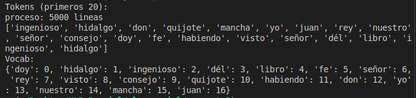
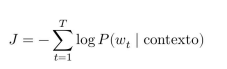

# NLP Parcial

## Pregunta 1

Se usa una función simple para tokenizar el corpus y solo separarlo usando split, obteniendo un array de los tokens

```python
def tokenize(text):
    return text.split()
```

Luego creamos la clase bigrama la cual se encargará de la inicialización de los unigramas y bigramas y su entrenamiento

Esta clase posee los siguientes atributos

```py
class bigram():
    corpus = None
    vocab = None
    bigram_count = {}
    unigram_count = {}

    def __init__(self, corpus:list, vocab):
        self.corpus = corpus
        self.vocab = vocab
        for word in vocab:
            cont = 0
            for sentence in corpus:
                sentence_token = tokenize(sentence)
                if word in sentence_token:
                    cont += 1

            self.unigram_count[word] = cont
        self.unigram_count["<s>"] = len(corpus)
        self.unigram_count["</s>"] = len(corpus)
```

``corpus``: Lista de oraciones.
``vocab``: Lista de palabras del vocabulario (incluye tokens de inicio ``<s>`` y fin ``</s>``).
``bigram_count``: Diccionario que almacena la frecuencia de cada bigrama.
``unigram_count``: Diccionario que almacena la frecuencia de cada unigrama


Luego continúa con el train, el cual se encarga de contar los bigramas dentro del corpus

```python
def train(self):
    for sentence in corpus:
        sentence_token = tokenize(sentence)

        if ('<s>',sentence_token[0]) not in self.bigram_count.keys():
                self.bigram_count[('<s>',sentence_token[0])] = 1
        else:
            self.bigram_count[('<s>',sentence_token[0])] += 1
        
        for i in range(len(sentence_token)-1):
            word_1 = sentence_token[i]
            word_2 = sentence_token[i+1]
            if (word_1, word_2) not in self.bigram_count.keys():
                self.bigram_count[(word_1, word_2)] = 1
            else:
                self.bigram_count[(word_1, word_2)] += 1

        if (sentence_token[-1],'</s>') not in self.bigram_count.keys():
            self.bigram_count[(sentence_token[-1],'</s>')] = 1
        else:
            self.bigram_count[(sentence_token[-1],'</s>')] += 1
```

Tenemos también

```py
def calculate_probability(self,word1,word2):
    count_word1_word2 = self.bigram_count[(word1,word2)]
    if word1 in vocab:
        count_word1 = self.unigram_count[word1]
    else:
        return 0
    probability = count_word1_word2/count_word1
    return probability
```

El cual retorna la probabilidad no suavizada del bigrama


Luego implementamos:

```py
def calculate_probability_add_k_smoothing(self,word1,word2,k):
    v = len(vocab)
    count_word1_word2 = k
    if (word1,word2) in self.bigram_count.keys():
        count_word1_word2 = self.bigram_count[(word1,word2)] + k
    
    count_word1 = k*v
    if word1 in self.vocab:
        count_word1 = self.unigram_count[word1] + k*v
    
    probability = count_word1_word2/count_word1
    return probability
```

y utilizándolo con k=1 obtenemos el suavizado add-one con los siguientes resultados


Luego usamos la misma función con k=0.05 y k=0.15


Finalmente implementamos backoff y stupid-backoff

```py
def backoff(self, word1, word2,lambda_factor = 1):
    if (word1,word2) in self.bigram_count.keys():
        return self.calculate_probability(word1,word2)
    else:
        return lambda_factor*self.unigram_count[word2]/len(vocab)
```

Para el backoff tomamos un lambda_factor de 1 y para el stupid-backoff un lambda_factor = 0.3


## Pregunta 2

Continuando con nuestro modelo del bigrama realizamos el suavizado de good turing

Primero obtenemos los r y los Nr para todos los unigramas de la parte 1

```py
def __init__(self, corpus:list, vocab: list):
    self.corpus = corpus
    self.vocab = vocab
    for word in vocab:
        cont = 0
        for sentence in corpus:
            sentence_token = tokenize(sentence)
            if word in sentence_token:
                cont += 1

        self.unigram_count[word] = cont
    
    for sentence in corpus:
        sentence_token = tokenize(sentence)
        for word in sentence_token:
            if word not in self.vocab:
                if '<UNK>' not in self.vocab:
                    self.vocab.append('<UNK>')
                    self.unigram_count['<UNK>'] = 1
                else:
                    self.unigram_count['<UNK>'] += 1

    self.unigram_count["<s>"] = len(corpus)
    self.unigram_count["</s>"] = len(corpus)
```


Luego para los r < 3 calculamos los cr y las probabilidades de los unigramas


Ahora calculamos la suma con máxima verosimilitud

```py
def calculate_mle_probability(self):
    total_count = sum(self.unigram_count.values())
    mle_probabilities = {}
    for word, count in self.unigram_count.items():
        if count == 3:
            mle_probabilities[word] = count / total_count
            print(f"P({word}) (MLE) = {mle_probabilities[word]:.6f}")
    return mle_probabilities
```

Con los siguientes resultados


Ahora evaluamos que la suma de las probabilidades sin ajustar superan el 1 y que al ajustarlas suman 1

Definimos la siguiente función para normalizar

```py
def normalize_probabilities(self):
    total_adjusted_count = sum(self.adjusted_counts.values())
    print(f"Suma de probabilidades sin ajustar: {total_adjusted_count:.6f}")
    normalized_probabilities = {}
    for word, adjusted_count in self.adjusted_counts.items():
        normalized_probabilities[word] = adjusted_count / total_adjusted_count
    print("\nProbabilidades normalizadas:")
    for word, prob in normalized_probabilities.items():
        print(f"P({word}) = {prob:.6f}")
    print(f"Suma de probabilidades normalizadas: {sum(normalized_probabilities.values()):.6f}")
    return normalized_probabilities
```

Al inicio se verifica la usma previo a la normalización

Y este es el siguiente output


## Pregunta 3

Comenzamos realizando la clase TextProcessor que va a procesar el input para tenerlo tokenizado

Comenzamos definiendo la clase con su ``__init__`` y los stopwords y suffixes

```py
class TextProcessor:
    def __init__(self, corpus_path):
        self.corpus_path = corpus_path
        self.stopwords = ['a', 'y', 'de', 'la', 'el', 'con', 'un', 'como', 'que', 'por', 'en', 'o', 'del',
                        'lo', 'para', 'ha', 'lo', 'se', 'al', 'e', 'una', 'su', 'entre', '', 'm', 'n', 'desde',
                        'i', 'pero', 'no', 'ya', 'sobre', 'si']
        self.suffixes = [
            'amiento', 'imientos', 'ación', 'aciones', 'adora', 'adoras', 'ador', 'adores', 
            'ante', 'antes', 'ancia', 'ancias', 'adora', 'adoras', 'ación', 'aciones',
            'imiento', 'imientos', 'ico', 'ica', 'icos', 'icas', 'iva', 'ivo', 'ivas', 'ivos',
            'mente', 'idad', 'idades', 'iva', 'ivo', 'ivas', 'ivos', 'anza', 'anzas', 'ero', 'era', 'eros', 'eras',
            'ces', 's', 'es'
        ]
```

Comenzamos el proceso realizando la lectura del corpus, debido al tamaño del archivo se procedió con hacer una carga por batches

```py
def preprocess_by_batches(self, batch_size, min_frequency=5):
    token_counts = {}
    ordered_tokens = []

    with open(self.corpus_path, 'r', encoding='utf-8') as f:
        batch = []
        cont = 0
        for line in f:
            batch.append(line.lower())
            if len(batch) == batch_size:
                tokens = self.tokenize(batch)
                tokens = self.lematizacion(tokens)
                tokens = self.remove_stopwords(tokens)
                
                ordered_tokens.extend(tokens)

                for token in tokens:
                    token_counts[token] = token_counts.get(token, 0) + 1

                batch = []
                cont += batch_size
                print(f"proceso: {cont} lineas")

        if batch:
            tokens = self.tokenize(batch)
            tokens = self.lematizacion(tokens)
            tokens = self.remove_stopwords(tokens)

            ordered_tokens.extend(tokens)

            for token in tokens:
                token_counts[token] = token_counts.get(token, 0) + 1

            cont += len(batch)
            print(f"proceso: {cont} lineas")

    filtered_tokens = [token for token in ordered_tokens if token_counts.get(token, 0) > min_frequency]
    
    return filtered_tokens
```

Este código procesa parte del archivo, lo tokeniza, lematiza, remueve las stopwords y quita los tokens menos comunes, ahora procederemos a cada parte del proceso.

Para tokenizar hacemos uso de una expresión regular la cual soporta los caracteres alfabéticos dentro de una word (incluyendo las tildes)

```py
def tokenize(self, corpus):
    tokens = []
    for line in corpus:
        tokens += re.findall(r'\b[a-zA-Zñáéíóúü]+\b', line)
    return tokens
```

Para el proceso de lematización, por cada token verificamos si posee el sufijo (tomando de mayor a menor) para retirarlos de la palabra y agregarlo a un nuevo conjunto de tokens

Finalmente hacemos uso del listc comprehension para el procesamiento de las stopwords y los tokens filtrados

```py
def remove_stopwords(self, tokens):
    new_tokens = [token for token in tokens if token not in self.stopwords]
    return new_tokens

def filter_tokens(self, tokens, min_frequency):
    token_counts = {}
    for token in tokens:
        token_counts[token] = token_counts.get(token, 0) + 1
    return [token for token in tokens if token_counts[token] > min_frequency]
```

Dentro del main hacemos uso de esta función

```py
from preprocess import TextProcessor


if __name__ == "__main__":
    corpus_path = './corpus/eswiki-latest-pages-articles.txt'
    processor = TextProcessor(corpus_path)

    tokens = processor.preprocess_by_batches(batch_size=5000, min_frequency=5, top=1)
```




Continuamos con el Brown Clustering

Hacemos uso de esta técnica para agrupar palabras basándonos en el contexto

Realizamos la inicialización de los clusters por palabra

```py
class BrownClustering:
    def __init__(self, tokens):
        self.tokens = tokens
        self.clusters = {}
        self.cluster_probs = {}
        self.transition_probs = {}
        self.pair_counts = {}
        self.total_words = len(tokens)
        self.cluster_counter = 0

    def initialize_clusters(self):
        unique_tokens = set(self.tokens)
        for word in unique_tokens:
            cluster_id = f"cluster_{self.cluster_counter}"
            self.cluster_counter += 1
            self.clusters[word] = cluster_id
            self.cluster_probs[cluster_id] = self.tokens.count(word) / self.total_words
        print(f"Inicialización: {len(self.clusters)} clusters creados.")
```

Luego implementamos la función para calcular las probabilidade entre ci, cj (probabilidades de transición)

```py
def calculate_probabilities(self):
    for i in range(len(self.tokens) - 1):
        c_i = self.clusters[self.tokens[i]]
        c_j = self.clusters[self.tokens[i + 1]]
        pair = (c_i, c_j)
        if pair not in self.pair_counts:
            self.pair_counts[pair] = 1
        else:
            self.pair_counts[pair] += 1

    total_bigrams = sum(self.pair_counts.values())
    self.transition_probs = {
        (c_i, c_j): count / total_bigrams for (c_i, c_j), count in self.pair_counts.items()
    }
    print("Probabilidades de transición calculadas.")
```

Implementamos la función, la disminución de información mutua entre clusters

```py
def mutual_information_reduction(self, cluster1, cluster2):
    p_c1 = self.cluster_probs.get(cluster1, 0)
    p_c2 = self.cluster_probs.get(cluster2, 0)
    p_combined = self.transition_probs.get((cluster1, cluster2), 0)
    
    if p_combined > 0 and p_c1 > 0 and p_c2 > 0:
        return p_combined * math.log(p_combined / (p_c1 * p_c2), 2)
    return 0
```

Junto a esta función se implementa una la cual permite encontrar el mejor par de cluster para fusionar

```py
def find_best_pair(self):
    best_pair = None
    best_reduction = float('inf')
    
    cluster_list = list(set(self.clusters.values()))
    for i in range(len(cluster_list)):
        for j in range(i + 1, len(cluster_list)):
            cluster1 = cluster_list[i]
            cluster2 = cluster_list[j]
            reduction = self.mutual_information_reduction(cluster1, cluster2)
            if reduction < best_reduction:
                best_reduction = reduction
                best_pair = (cluster1, cluster2)
    return best_pair
```

Luego se implementa la función para juntar (merge) los clusters, creando uno nuevo

```py
def merge_clusters(self, cluster1, cluster2):
    new_cluster = f"cluster_{self.cluster_counter}"
    self.cluster_counter += 1
    new_prob = self.cluster_probs.get(cluster1, 0) + self.cluster_probs.get(cluster2, 0)

    for word in self.clusters:
        if self.clusters[word] == cluster1 or self.clusters[word] == cluster2:
            self.clusters[word] = new_cluster

    self.cluster_probs[new_cluster] = new_prob

    if cluster1 in self.cluster_probs:
        del self.cluster_probs[cluster1]
    if cluster2 in self.cluster_probs:
        del self.cluster_probs[cluster2]
        
    print(f"Clusters {cluster1} y {cluster2} fusionados en {new_cluster}.")
```

FInalmente implementamos la función fit la cual fusiona cluster hasta tener el número deseado de clusters

```py
def fit(self, target_clusters=100):
    self.initialize_clusters()
    self.calculate_probabilities()
    
    while len(set(self.clusters.values())) > target_clusters:
        cluster1, cluster2 = self.find_best_pair()
        if cluster1 and cluster2:
            self.merge_clusters(cluster1, cluster2)
        else:
            break

    return self.clusters
```


Podemos visualizar los tokens y su cluster


Tendrían la siguiente estructura

``` json
{'fuent': 'cluster_10151', 'plano': 'cluster_9769', 'atrá': 'cluster_9889', 'utilizado': 'cluster_10151', 'hallado': 'cluster_9989', 'aproxim': 'cluster_9640', 'jehová': 'cluster_9780', 'varía': 'cluster_10096', 'carta': 'cluster_10049', 'institución': 'cluster_10120', 'rocosa': 'cluster_9981', 'mortal': 'cluster_9981', 'icono': 'cluster_10135', 'pe': 'cluster_9837', 'clara': 'cluster_9889', 'participado': 'cluster_6972', 'marte': 'cluster_10096', 'goza': 'cluster_9780', 'vall': 'cluster_9989', 'cilíndr': 'cluster_10030', 'coalición': 'cluster_10037', 'experiencia': 'cluster_10045', 'precipit': 'cluster_9439', 'restrict': 'cluster_9681', 'conclusión': 'cluster_10042', 'comenzado': 'cluster_10135', 'movil': 'cluster_9407', 'cien': 'cluster_10135', 'parque': 'cluster_10049', 'asteraceae': 'cluster_10086', 'violeta': 'cluster_10099', 'sentido': 'cluster_10096', 'aceite': 'cluster_9953', 'viajar': 'cluster_10096'}
```

Teniendo como key el token y como value el cluster

Ahora se implementará el LSA

```py
class LSA:
    def __init__(self, documents, k, max_iterations=100, tolerance=1e-6):
        self.documents = documents
        self.k = k
        self.max_iterations = max_iterations
        self.tolerance = tolerance
        self.terms = []
        self.X = []
        self.U = []
        self.Sigma = []
        self.Vt = []
```

Creamos el constructor del LSA el cual tendrá los parámetros para recibir la lista de documentos (`docuemnts`), el número de dimensiones a conservar (`k`), los parámetros para el método de potencia (max_iteracions y tolerance), almacenamos los términos únicos (`terms`) y la matriz término (X), con su reducción de dimensionalidad (X_k) documento con las matrices de la descomposición SVD (U, Sigma, Vt)

Construimos la matriz término documento

```py
def build_term_document_matrix(self):
        terms = {}
        for document in self.documents:
            for word in document.split():
                if word not in terms:
                    terms[word] = len(terms)

        X = [[0] * len(terms) for _ in range(len(self.documents))]
        for i, document in enumerate(self.documents):
            for word in document.split():
                X[i][terms[word]] += 1

        for j in range(len(terms)):
            df = sum(1 for i in range(len(self.documents)) if X[i][j] > 0)
            idf = math.log(len(self.documents) / (df + 1))
            for i in range(len(self.documents)):
                tf = X[i][j] / (sum(X[i]) + 1)
                X[i][j] = tf * idf

        self.X = X
        self.terms = list(terms.keys())
```

Para la construcción de la matriz término documento, primero construimos el vocabulario con los términos únicos, luego llenamosla matriz con la frecuencia de términos en los documentos y finalmente hacemos uso del tf-idf.

Ahora implementamos el cálculo de las matrices de SVD utilizando el método de potencia

```py
    def power_method(self, matrix):
        m, n = len(matrix), len(matrix[0])
        b_k = [random.random() for _ in range(n)]
        
        norm_b_k = math.sqrt(sum(x**2 for x in b_k))
        b_k = [x / norm_b_k for x in b_k]
        
        for _ in range(self.max_iterations):
            b_k1 = [sum(matrix[i][j] * b_k[j] for j in range(n)) for i in range(m)]
            b_k1 = [sum(matrix[j][i] * b_k1[j] for j in range(m)) for i in range(n)]
            
            norm_b_k1 = math.sqrt(sum(x**2 for x in b_k1))
            b_k1 = [x / norm_b_k1 for x in b_k1]

            if all(abs(b_k[i] - b_k1[i]) < self.tolerance for i in range(n)):
                return norm_b_k1, b_k1
            
            b_k = b_k1
        return norm_b_k1, b_k1

    def approximate_svd(self):
        A = [row[:] for row in self.X]
        U, Sigma, Vt = [], [], []

        for _ in range(self.k):
            singular_value, v = self.power_method(A)
            u = [sum(A[i][j] * v[j] for j in range(len(v))) / singular_value for i in range(len(A))]

            U.append(u)
            Sigma.append(singular_value)
            Vt.append(v)

            for i in range(len(A)):
                for j in range(len(A[0])):
                    A[i][j] -= singular_value * u[i] * v[j]

        self.U = [list(col) for col in zip(*U)]
        self.Sigma = [[Sigma[i] if i == j else 0 for j in range(self.k)] for i in range(self.k)]
        self.Vt = Vt
```

Creamos un vector aleatorio inicial y lo normalizamos (b_k). Continuamos con el método iterativo para el cálculo de los autovectores dominantes, finalmente se retorna el vector y valor propio dominante.

Luego en el cálculo del SVD usamos el método de potencia solo hasta la dimensión k y hacemos el llenado de las matrices de descomposición.

Luego a la copia de la matriz X (A), le restamos el valor singular para asegurar que el método de potencia calcule el siguiente autovalor.

```py
def reduce_dimensionality(self):
    self.X_k = []

    for i in range(len(self.U)):
        row = []
        for j in range(len(self.Vt[0])):
            value = 0
            for p in range(self.k):
                value += self.U[i][p] * self.Sigma[p][p] * self.Vt[p][j]                
            row.append(value)
        self.X_k.append(row)
```

Realizamos la reducción de dimensionalidad iterando sobre los términos de las filas de U y cada documento de las columnas de Vt, calculamos la proyección múltiplicamos el valor de U y el valor singular de Sigma y el valor de Vt y lo almacenamos en un X_k

Continuamos con la implementación de Word2Vec

```py
class Word2Vec:
    def __init__(self, vocab, embedding_dim=100, window_size=2, negative_samples=5, learning_rate=0.01, epochs=10, sg=1):
        self.vocab = vocab
        self.vocab_size = len(vocab)
        self.embedding_dim = embedding_dim
        self.window_size = window_size
        self.negative_samples = negative_samples
        self.learning_rate = learning_rate
        self.epochs = epochs
        self.sg = sg
        self.W_in, self.W_out = self.initialize_vectors()

```

Luego del procesamiento realizamos el CBOW:

```py
def get_context(self, tokens, idx):
    start = max(0, idx - self.window_size)
    end = min(len(tokens), idx + self.window_size + 1)
    return [tokens[i] for i in range(start, end) if i != idx]
```

Calculamos el contexto tomando el window_size, obteniendo los tokens cercanos y retornándolos en una lista.

Implementamos la función pérdida negativa logarítmica



Con la siguiente función:

```py
def cbow_loss(self, context_words, target_idx):
    context_vector = [0] * self.embedding_dim
    for context_word_idx in context_words:
        context_vector = self.vector_add(context_vector, self.W_in[context_word_idx])
    context_vector = self.scalar_multiply(context_vector, 1 / len(context_words))

    target_dot_product = self.dot_product(self.W_out[target_idx], context_vector)
    numerator = math.exp(target_dot_product)

    denominator = sum(math.exp(self.dot_product(self.W_out[i], context_vector)) for i in range(self.vocab_size))

    probability = numerator / denominator

    loss = -math.log(probability)

    gradient = 1 - probability

    return loss, gradient, context_vector
```

Luego implementamos el proceso de training con el step utilizando el descenso de gradiente básico

```py
def cbow_step(self, context_words, target_idx):
    loss, gradient, context_vector = self.cbow_loss(context_words, target_idx)

    self.W_out[target_idx] = self.vector_add(self.W_out[target_idx], 
                                            self.scalar_multiply(context_vector, self.learning_rate * gradient))

    for context_word_idx in context_words:
        self.W_in[context_word_idx] = self.vector_add(self.W_in[context_word_idx], 
                                                    self.scalar_multiply(self.W_out[target_idx], self.learning_rate * gradient))
    return loss
```

Ahora la implementación del skip-grama

Primero su función de pérdida que está presenta la implementación

```py
def skipgram_loss(self, target_vector, context_vector, label):
    dot_product = self.dot_product(target_vector, context_vector)
    prediction = self.sigmoid(dot_product)
    loss = -math.log(prediction) if label == 1 else -math.log(1 - prediction)
    gradient = prediction - label
    
    return loss, gradient
```

Paso del skipgrama

```py
def skipgram_step(self, target_idx, context_word_idx):
    pos_loss, pos_gradient = self.skipgram_loss(self.W_in[target_idx], self.W_out[context_word_idx], 1)
    self.W_in[target_idx] = self.vector_add(self.W_in[target_idx], 
                                                self.scalar_multiply(self.W_out[context_word_idx], -self.learning_rate * pos_gradient))
    self.W_out[context_word_idx] = self.vector_add(self.W_out[context_word_idx], 
                                                    self.scalar_multiply(self.W_in[target_idx], -self.learning_rate * pos_gradient))
    neg_samples = self.negative_sampling(target_idx)
    neg_loss = 0
    for neg_word_idx in neg_samples:
        neg_loss_sample, neg_gradient = self.skipgram_loss(self.W_in[target_idx], self.W_out[neg_word_idx], 0)
        neg_loss += neg_loss_sample

        self.W_in[target_idx] = self.vector_add(self.W_in[target_idx], 
                                                    self.scalar_multiply(self.W_out[neg_word_idx], -self.learning_rate * neg_gradient))
        self.W_out[neg_word_idx] = self.vector_add(self.W_out[neg_word_idx], 
                                                    self.scalar_multiply(self.W_in[target_idx], -self.learning_rate * neg_gradient))
    return pos_loss + neg_loss
```

Ahora la implementación del GloVe

Construimos la matriz de coocurrencia

```py
def build_co_occurrence_matrix(self, tokens, window_size):
    for i, word in enumerate(tokens):
        if word in self.word_to_index:
            current_word_index = self.word_to_index[word]
            for j in range(max(0, i - window_size), min(len(tokens), i + window_size + 1)):
                if j != i and tokens[j] in self.word_to_index:
                    context_word_index = self.word_to_index[tokens[j]]
                    self.co_occurrence_matrix[current_word_index][context_word_index] += 1
```

Definimos la función de costos y el cálculo de los pesos

```py
def cost_function(self):
    J = 0
    for i in range(self.vocab_size):
        for j in range(self.vocab_size):
            if self.co_occurrence_matrix[i][j] > 0:
                x_ij = self.co_occurrence_matrix[i][j]
                weight = self.weight_function(x_ij)
                prediction = self.dot_product(self.word_vectors[i], self.word_vectors[j]) + self.biases[i] + self.biases[j]
                J += weight * (prediction - math.log(x_ij)) ** 2
    return J

def weight_function(self, x_ij):
    if x_ij < self.x_max:
        return (x_ij / self.x_max) ** self.alpha
    else:
        return 1
```

Y actualizamos los sezgos

```py
def train(self, tokens, window_size, epochs):
    self.build_vocab(tokens)
    self.build_co_occurrence_matrix(tokens, window_size)
    
    for epoch in range(epochs):
        print(f"Epoch: {epoch}")
        for i in range(self.vocab_size):
            for j in range(self.vocab_size):
                if self.co_occurrence_matrix[i][j] > 0:
                    x_ij = self.co_occurrence_matrix[i][j]
                    weight = self.weight_function(x_ij)
                    prediction = self.dot_product(self.word_vectors[i], self.word_vectors[j]) + self.biases[i] + self.biases[j]
                    
                    error = prediction - math.log(x_ij)
                    
                    for k in range(self.vector_dim):
                        grad = weight * error * self.word_vectors[j][k]
                        self.word_vectors[i][k] -= self.learning_rate * grad
                        
                    # Actualizar sesgos
                    self.biases[i] -= self.learning_rate * weight * error
                    self.biases[j] -= self.learning_rate * weight * error
```